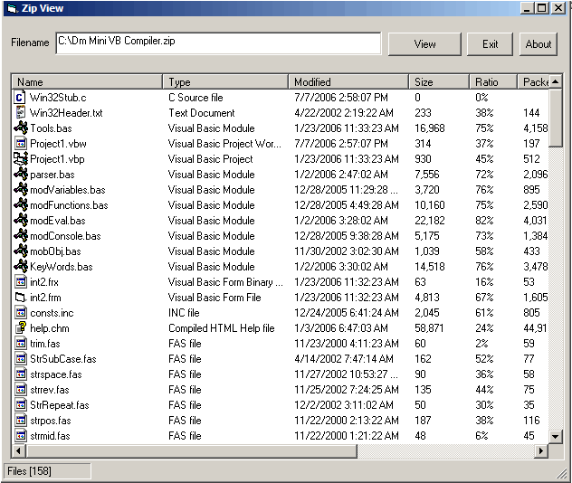



## DM ZipViewer

### Description

Nise little project to view the contents of zip files anyway I made it as a Class DLL so you can easy load the dll into your projects, comes with full source of dll+ example, can view all files in size includeing, sizes, ratios, Paths, and much more, Example project allows you to also use the listview and add the files and File icons, etc anyway there maybe one or two bug not sure as it only took 30 min to write anyway hope it maybe of some use.
 
### More Info
 

             |
---                |---
**Submitted On**   |2004-12-21 05:41:56
**By**             |[dreamvb](https://github.com/Planet-Source-Code/PSCIndex/blob/master/ByAuthor/dreamvb.md)
**Level**          |Beginner
**User Rating**    |5.0 (20 globes from 4 users)
**Compatibility**  |VB 6\.0
**Category**       |[Files/ File Controls/ Input/ Output](https://github.com/Planet-Source-Code/PSCIndex/blob/master/ByCategory/files-file-controls-input-output__1-3.md)
**World**          |[Visual Basic](https://github.com/Planet-Source-Code/PSCIndex/blob/master/ByWorld/visual-basic.md)
**Archive File**   |[DM\_ZipView200473762006\.zip](https://github.com/Planet-Source-Code/dreamvb-dm-zipviewer__1-65880/archive/master.zip)

